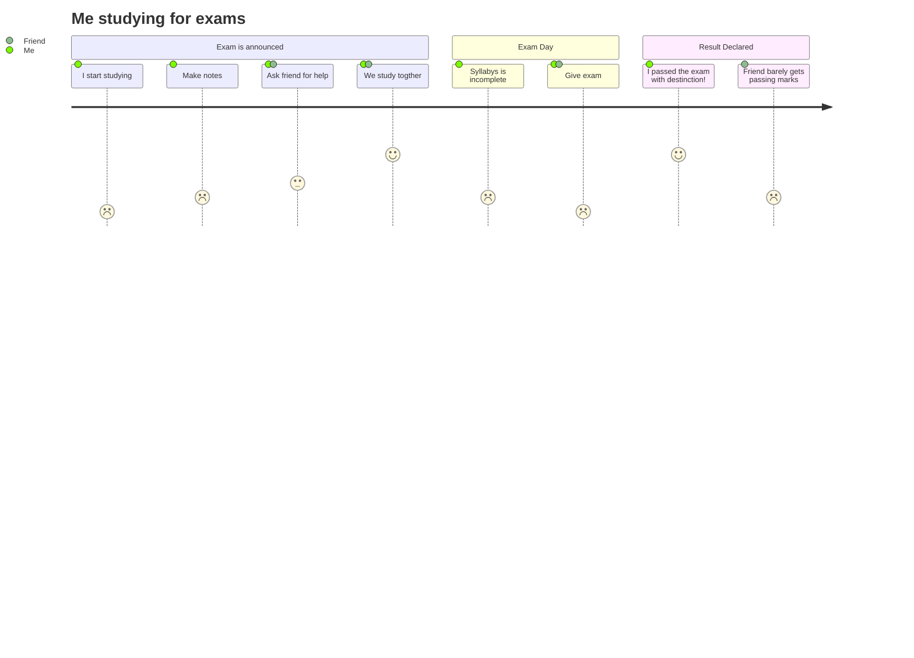
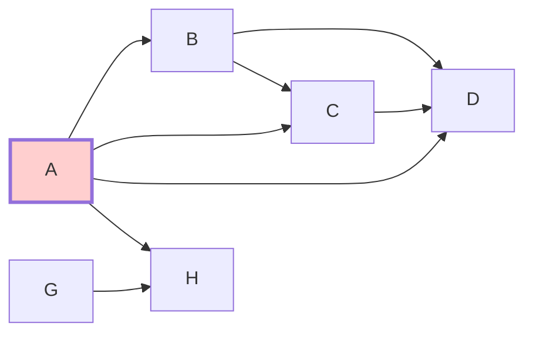
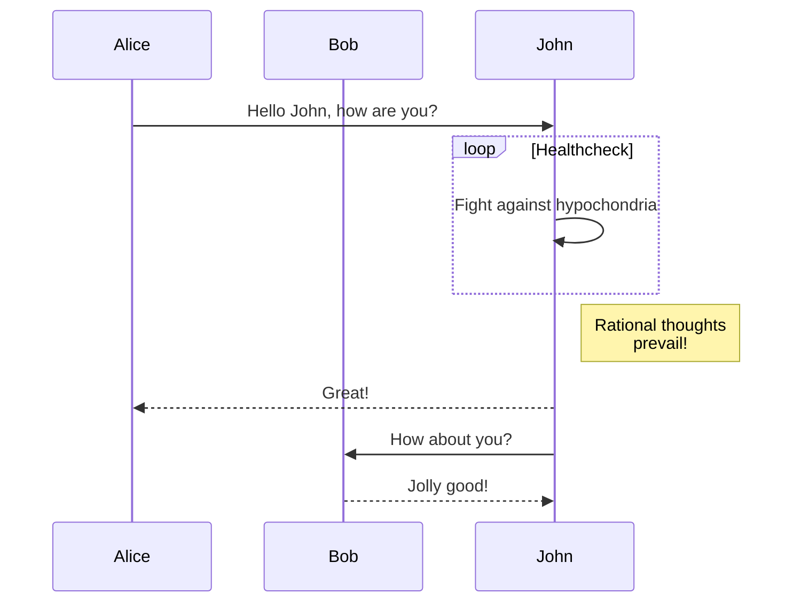
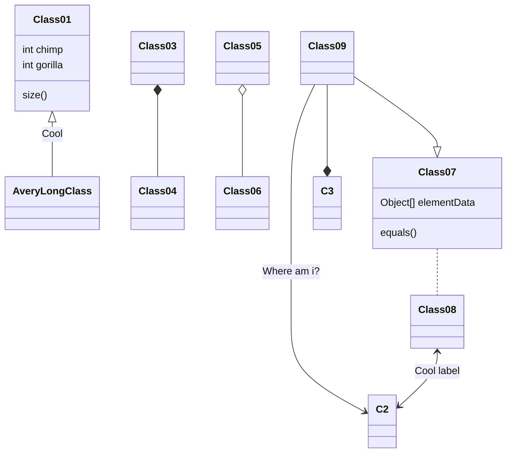

# Activate venv on Windows bash:

- cd to `venv/Scripts`
- `. activate` -> don't forget the dot and space followed by `activate`

## To deactivate venv on Windows bash:

- `deactivate`

## List all requirements:

- `pip freeze`

## Install requirements:

- `pip install -r requirements.txt`

## for formating the code:

- `pip install black`
- apply it to the code:
  `python -m black .`

